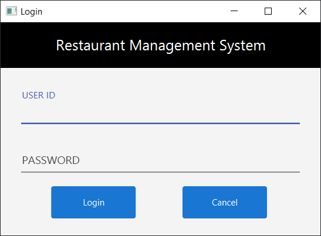
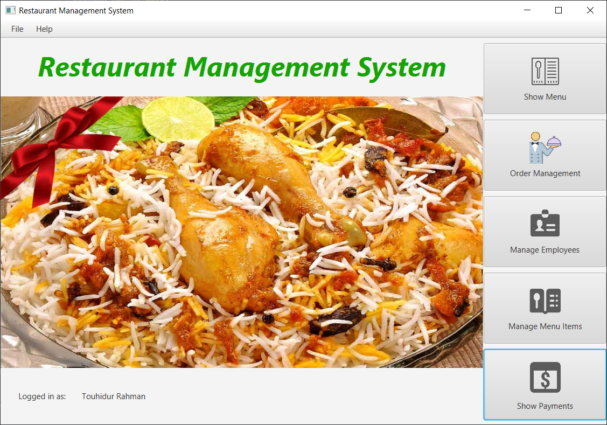
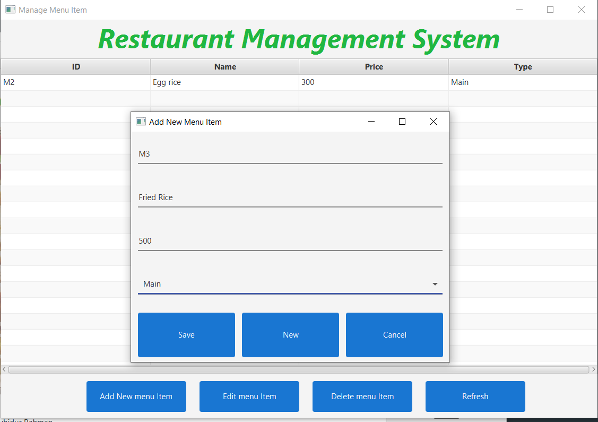
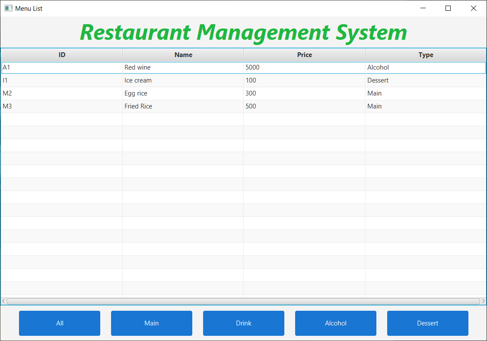
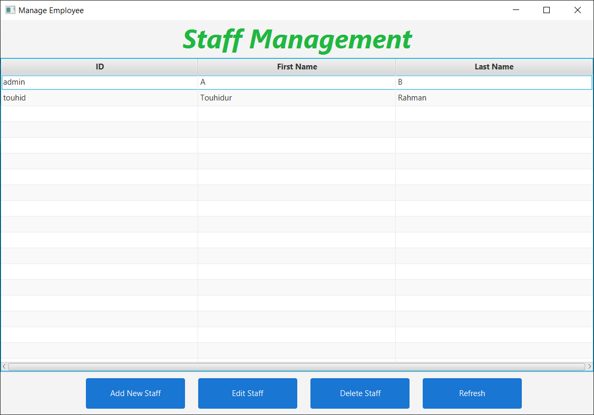
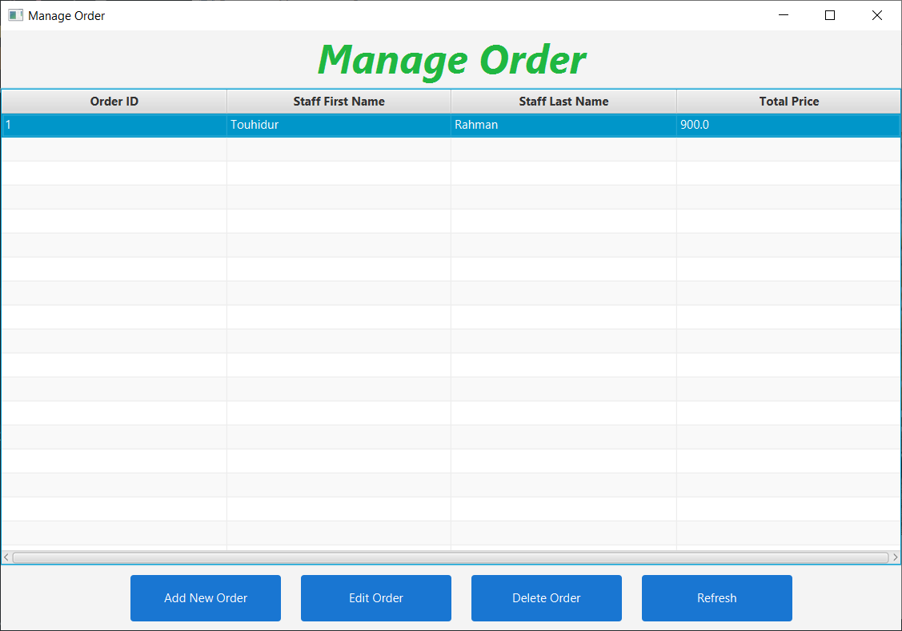
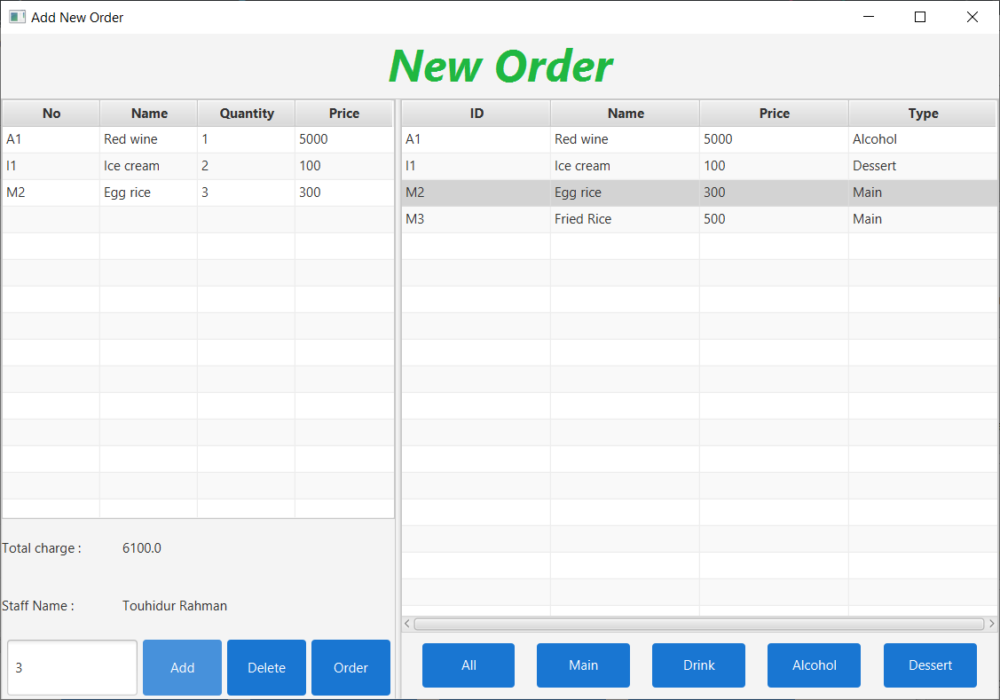
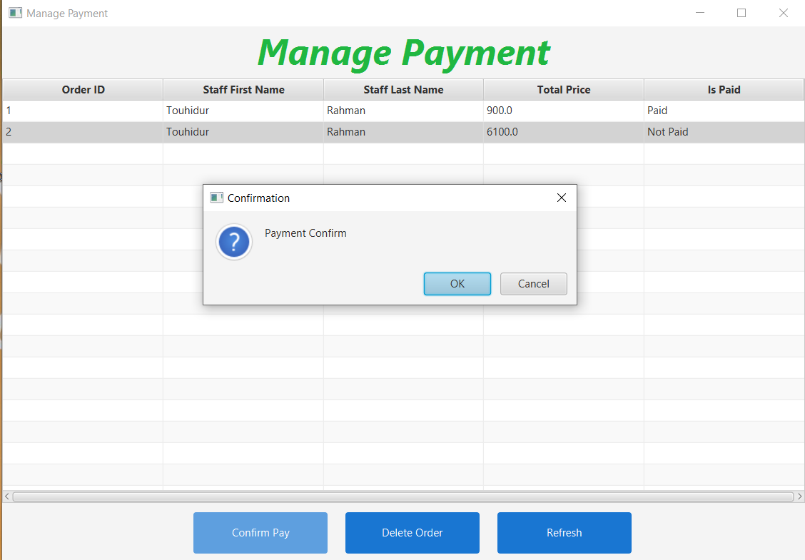

# Restaurant Management System Using JavaFX

> --By Touhidur Rahman

**Table of Content :**

1. Summary
1. [Login Section](#login-section)
1. [Main Screen section](#main-screen-section)
1. [Manage Menu Section](#manage-menu-section)
1. [Menu List Section](#menu-list-section)
1. [Manage Employee Section](#manage-employee-section)
1. [Add Order Section](#add-order-section)
1. [Manage Payment Section](#manage-payment-section)

## Login Section

### Default Login Credentials

An rms.sql file is also included in the repository if you want you can just import the file and all the tables will be created.

| Username | Password |
| :------- | :------- |
| admin    | 12345    |

### Libraries Used

- [JFoenix](https://github.com/jfoenixadmin/JFoenix) - JavaFX Material Design Library
- [Mysql Connector](https://dev.mysql.com/downloads/connector/j/) - Mysql Connector Java 8.0.20

Here you can log in with your user id and password.

## Main Screen section

After successful login, you will see the Main Screen with your Name.

## Manage Menu Section

In the manage menu section, you can view added menus and create, update and delete menus too.

## Menu List Section

In the Menu List section, you can view all added menus and you can filter them by category example (All, Main, Drink)

## Manage Employee Section

In this section you can manage employees, you can create, update and delete employees

## Manage Order Section

In this section you can manage orders, you can create, update and delete orders

## Add Order Section

In this section you can add a new order, you can add an order according to your wish can add and delete the item on the fly you can also add any quantity after adding or deleting the price will be changed automatically.

## Manage Payment Section

In this section, you can manage payment. All the payment by default is unpaid so after the customer pays the bill you can confirm the payment and the isPaid section will be shown Paid.

